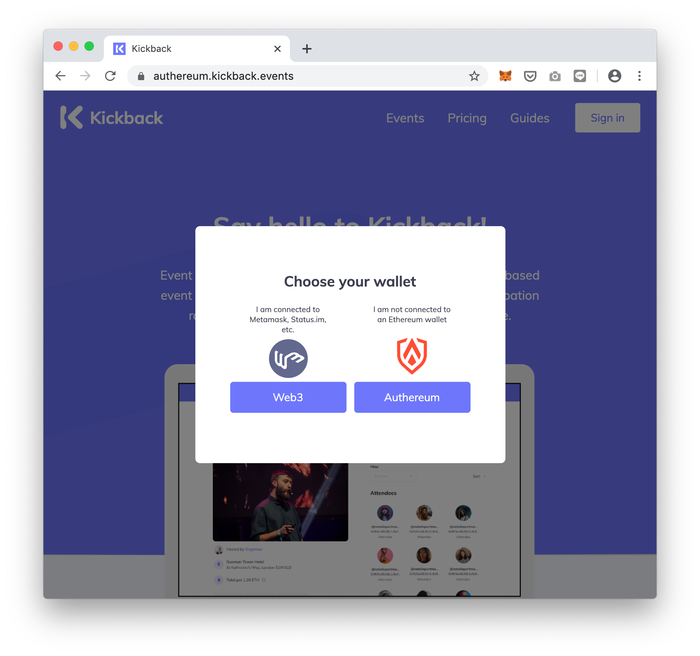
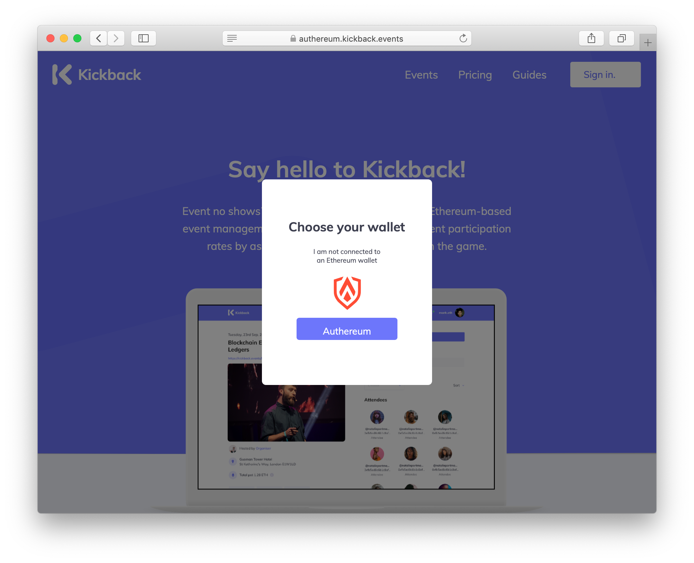
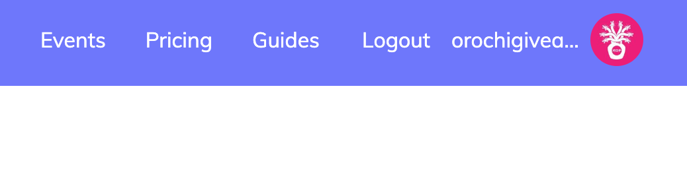

# Wallet integration guide.

This document is aimed for embedded wallet provider who plans to be integrated into Kickback.

There are already examples of PR made by other wallet providers which you can use as references.

- [Universal Login](https://github.com/wearekickback/app/pull/182)
- [Authereum](https://github.com/wearekickback/app/pull/156)

## Requirements

We do expect that your wallet has the following capabilities.

- Simple wallet capability to send/receive ETH/DAI (Otherwise wallet UI need to be built into Kickback)
- Support for test environment (we currently use Kovan)

In addition to these basic features, we welcome any wallet supporting the following capabilities.

- Send/receive NFT (as poap.xyz often airdrop tokens to participants)
- Buy ETH/DAI via Credit/Debit/Apple pay/Google pay (we prefer solutions that work especially in Europe and the UK).

## Integration UI flow

### Sign up/Sign in modal

#### When injected web3 provider (Metamask, Opera, Mobile wallet, etc) are detected.

It should give the option to use either injected web3 objects or one of the embedded wallet provider objects.

#### When there is no injected web3 provider.

### Authentication

If the wallet is an Externally Owned Account, it should work out of the box.
If the wallet is Contract based, then your contract has to have support for  EIP 1271.

For more detail, please read [Integrating a contract based wallet into your Dapp.](https://medium.com/wearekickback/integrating-a-contract-based-wallet-into-your-dapp-1721c1a1148b)

### Wallet Icon

By the time users log in using your solution, the wallet of the users is usually empty. Since Kickback does not have any wallet feature, you have to inject your wallet icon next to the user profile name.

By clicking your wallet icon, it should either pop up your wallet modal or redirect it to your wallet page.

If your wallet does not have basic wallet capability, it needs to be built.

### Logout Button

By clicking `Logout` it must show the Login button.

### User guide.

We have [a simple user guide page](https://kickback.events/gettingstarted).
If your wallet have any specific instruction users must follow, please add it here.
We also welcome any video guide which helps noob users to create your wallet account, top up crypto, sign in to our platfrom, then RSVP to an event.

## Coding conventions.

Please follow our contribution guide on our test page.

## Testing.

### Testing criteria

- [ ] User can login/logout
- [ ] User can create an event (kovan.kickback.events/create)
- [ ] User can RSVP, finalize, and withdraw
- [ ] There is a on boarding guide which users can refer to

### Supported browser and wallets.

#### Injected Web3

Please make sure that the existing web3 provider works.

- [] Brave/Chrome with Metamask plugin enabled
- [] Brave/Chrome with Metamask plugin enabled
- [] Opera
- [] Status.im
- [] Metamask Mobile
- [] Trust Wallet
- [] Coinbase Wallet

#### Embedded wallet

Please make sure that your wallet, as well as already integrated wallets, work.

- Brave
- Chrome
- Safari
- Firefox
